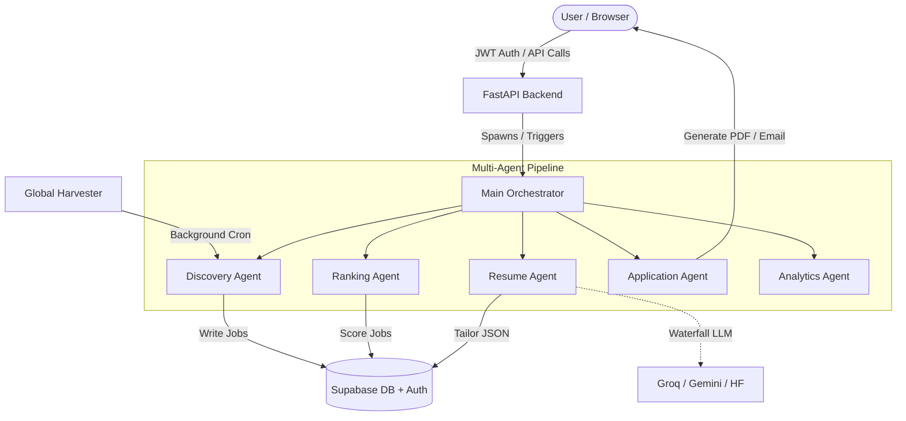

# 🏛 Architecture

PhantmOS v3.0 utilizes a **Multi-Agent, Event-Driven SaaS Architecture**. It strictly separates business logic into independent agents while maintaining a centralized state in Supabase. 

## 🏗 High-Level Architecture

The system operates across three main tiers:
1. **The Client (Frontend)**: A React-based Single Page Application providing a Command Center dashboard.
2. **The Orchestrator (Backend)**: A FastAPI layer that serves API requests and runs background APScheduler loops.
3. **The Brain (Agents & LLMs)**: Specialized agents orchestrating external API calls, LLM synthesis, and file generation.

## 📊 Component Diagram

## 🔄 Request Lifecycle (Pipeline Flow)

The core strength of the architecture is the asynchronous pipeline loop defined in `main_orchestrator.py`:

1. **Stage 1 (Discovery)**: The `DiscoveryAgent` queries the `global_jobs` pool or reaches out to external APIs (Remotive, Himalayas). It filters noise using keywords and saves viable leads to `user_job_pipelines`.
2. **Stage 2 (Ranking)**: The `RankingAgent` loads pending jobs and scores them using three mechanisms:
   - **Semantic Score**: Jina/Local embeddings comparison between job description and resume.
   - **Keyword Score**: TF-IDF style exact matching.
   - **Title Score**: Exact/Fuzzy role matching.
   The job is placed in a Band (HOT, WARM, COLD).
3. **Stage 3 (Tailoring)**: The `ResumeAgent` invokes the LLM Waterfall (Groq -> Gemini -> HF). It dynamically rewrites the resume's JSON data to highlight relevant skills for HOT/WARM leads.
4. **Stage 4 (PDF Generation)**: The `ApplicationAgent` converts the tailored JSON into a professional PDF using Jinja2 and WeasyPrint, uploading the result to Supabase Storage.
5. **Stage 5 (Delivery)**: The `ApplicationAgent` sweeps the `delivery_queue`. It dispatches Telegram alerts containing job cards and sends cold emails via Gmail SMTP.

## 🗄 Database Design

The database relies on a highly normalized relational structure utilizing Supabase PostgreSQL:

- **`auth.users`**: Core identity (managed by Supabase Auth).
- **`user_profiles`**: Trigger-synced table containing user credits, encrypted API keys, and global preferences.
- **`global_jobs`**: Centralized pool of discovered jobs. Contains `dedup_hash` to prevent duplicates across the entire SaaS.
- **`user_job_pipelines`**: The junction table connecting users to global jobs. Stores the user-specific state, `match_score`, `score_band`, and tailored resume URLs.
- **`delivery_queue`**: Asynchronous processing queue for emails/Telegram.

## 🔐 Authentication Flow

1. User authenticates via frontend using Supabase Auth.
2. Supabase issues a JWT.
3. The React frontend passes the JWT in the `Authorization: Bearer <token>` header to the FastAPI backend.
4. FastAPI's `get_current_user_id` dependency verifies the token and securely identifies the tenant.

## 🚀 Scalability Considerations

- **Global Harvester Optimization**: Instead of N users making API requests, `global_harvester.py` aggregates all unique user target roles, runs the API requests once, and populates `global_jobs`.
- **Database Partitioning**: `user_resumes` is partitioned (via application logic/triggers) to handle high-frequency resume edits.
- **Stateless Agents**: Agents hold no state. They read from Supabase and write to Supabase, allowing horizontal scaling.
- **LLM Waterfall**: Falls back through providers (Groq -> Gemini -> HF) to prevent complete pipeline failures due to rate limiting.
