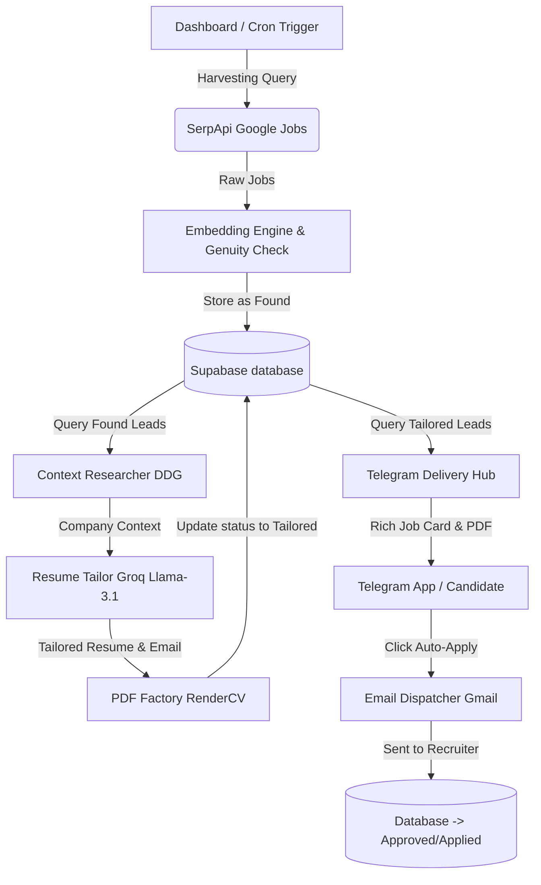

# Ghost Protocol Command Center — System Architecture & Implementation Report

Welcome to the comprehensive technical report for the **Ghost Protocol Engine**. This document breaks down the purpose, architecture, implementation workflow, and detailed file structures that make this autonomous job application system function.

---

## 1. Executive Summary: What It Does
**Ghost Protocol** is an autonomous, AI-driven job discovery, resume-tailoring, and application engine. It replaces the traditional manual job hunt with a continuous, hyper-personalized automation pipeline that runs locally or in cloud environments (like Hugging Face Spaces).

### Core Features:
*   **Stealth Harvesting**: Scrapes high-quality job matches across regional locations using Google Search (SerpApi).
*   **Vector Embeddings & Semantic Scoring**: Computes similarity scores between discovered job descriptions and the candidate's master resume using local transformer embeddings (`all-MiniLM-L6-v2`), ensuring a strict or customized match threshold.
*   **Dynamic Company Research**: Gathers deep context and recent milestones about hiring companies using DuckDuckGo scraping.
*   **Surgical Resume Tailoring**: Employs **Llama-3.1-8b** (via Groq API) to surgically adjust the candidate's resume highlights and generate a highly personalized, context-aware 3-sentence cold introductory email.
*   **On-the-Fly PDF Factory**: Automatically compiles the newly tailored JSON resume structure into an ATS-optimized PDF ready for distribution.
*   **Telegram Command & Control**: Ships rich job cards, tailored resumes, and cold email templates directly to the candidate's Telegram chat, complete with one-click **"Auto-Apply"** interactive buttons.

---

## 2. High-Level System Architecture
The application runs on a three-stage modular pipeline orchestrated asynchronously or triggered manually via a modern Glassmorphic dashboard.

---

## 3. Technology Stack & Key Integrations
The engine is built on a modern, ultra-reliable Python and Javascript web stack:

| Layer | Technology | Purpose |
| :--- | :--- | :--- |
| **Backend Framework** | `FastAPI` (Uvicorn) | High-performance async API backend. |
| **Database** | `Supabase` (PostgreSQL) | Stores persistent job leads, master profiles, and vectors. |
| **LLM & AI API** | `Groq` (Llama-3.1-8b-instant) | JSON-based resume tailoring and cold email synthesis. |
| **Search Scraper** | `SerpApi` (Google Jobs Engine) | Fast, reliable multi-platform job harvesting. |
| **Semantic Matching** | `SentenceTransformers` (`all-MiniLM-L6-v2`) | Local execution of vector similarity comparison. |
| **UI Dashboard** | Vanilla HTML, CSS, JavaScript | Interactive, premium glassmorphic control center. |
| **Notification / C&C** | `python-telegram-bot` API | Delivers rich interactive job cards directly to mobile. |

---

## 4. Comprehensive File Breakdown

Here is a microscopic directory-by-directory breakdown of every operational file in the project.

### Root Infrastructure Files
*   [Dockerfile](file:///home/unshakensoul/Documents/siro/Dockerfile): Configuration for building a lightweight Debian-based Python 3.12 Docker image. Deploys minimal standard system libraries, installs required pip dependencies, and runs the starting entrypoint script.
*   [entrypoint.sh](file:///home/unshakensoul/Documents/siro/entrypoint.sh): A bash script executing on container startup. Spins up the background autonomous orchestrator (`main_orchestrator.py`) and launches the frontend dashboard server (`dashboard.py`) on port `7860`.
*   [requirements.txt](file:///home/unshakensoul/Documents/siro/requirements.txt): Lists all top-level Python packages (FastAPI, Uvicorn, Supabase, SerpApi, Httpx, APScheduler, Python-Telegram-Bot, etc.).
*   [schema.sql](file:///home/unshakensoul/Documents/siro/schema.sql): The foundational database SQL schema. Installs PostgreSQL extensions (pgcrypto, pgvector), configures tables (`user_profiles`, `job_leads` with strict constraints), defines indexes, and seeds Akash's initial master profile.

### Core Database Layer (`/core`)
*   [core/database_manager.py](file:///home/unshakensoul/Documents/siro/core/database_manager.py): The operational database driver. Initializes the Supabase client safely and exposes functions to query the master professional profile, update details, upsert job leads, and select leads based on status.

### Pipeline Intelligence Layer (`/intelligence`)
*   [intelligence/embedding_engine.py](file:///home/unshakensoul/Documents/siro/intelligence/embedding_engine.py): Manages sentence-level vector calculations. Generates 384-dimensional embeddings locally using PyTorch and SentenceTransformers, and computes cosine similarity scores to dynamically gauge job match percentages.
*   [intelligence/genuity_checker.py](file:///home/unshakensoul/Documents/siro/intelligence/genuity_checker.py): Screen-tests companies against ghost-job listings. Leverages DuckDuckGo searches to verify the company's real-world business footprint and registers a status flag.
*   [intelligence/harvesting_engine.py](file:///home/unshakensoul/Documents/siro/intelligence/harvesting_engine.py): Handles SerpApi queries. Pulls Google Job postings matching search terms, maps data, filters them through a matching score threshold (recently lowered to 10% for broader intern discovery), and registers them inside the database as `"Found"`.

### Synthesis & Tailoring Layer (`/synthesis`)
*   [synthesis/context_researcher.py](file:///home/unshakensoul/Documents/siro/synthesis/context_researcher.py): The deep-research scraper. Scrapes DuckDuckGo search queries for recent company news, hiring department milestones, or technological stacks to pass to the AI copywriter.
*   [synthesis/resume_tailor.py](file:///home/unshakensoul/Documents/siro/synthesis/resume_tailor.py): Connects to the Groq Llama-3.1 API. Rewrites 2-3 recent bullet points from the master JSON to directly match the JD, restricts highlights to fit a single-page target, and synthesizes a high-converting 3-sentence cold email.
*   [synthesis/pdf_factory.py](file:///home/unshakensoul/Documents/siro/synthesis/pdf_factory.py): Generates clean, publication-quality PDFs. Interprets the newly updated JSON resume layout, renders the document using custom formatting wrappers, and writes the output as a `.pdf` file to the static resumes directory.

### Interactive Frontend & Interfaces (`/interface`)
*   [interface/telegram_delivery.py](file:///home/unshakensoul/Documents/siro/interface/telegram_delivery.py): Coordinates rich messaging. Constructs highly readable Markdown cards showing the match score, role overview, and AI logic, attaches the tailored PDF resume, sends the cold email body, and attaches inline buttons for immediate apply/dismiss clicks.
*   [interface/dashboard/index.html](file:///home/unshakensoul/Documents/siro/interface/dashboard/index.html): The complete Command Center UI. A stunning layout leveraging modern neon branding, Glassmorphic overlays, tabbed navigation (Global Radar, Kanban CRM, Master Identity, System Config), and fully reactive JS event-handling.

### Execution Control Files
*   [dashboard.py](file:///home/unshakensoul/Documents/siro/dashboard.py): The main FastAPI server file. Hosts dashboard index assets, exposes CRUD endpoints to fetch/save profiles and `.env` settings, and houses the manual API endpoint `/api/harvest` to fire the orchestrator pipeline instantly.
*   [main_orchestrator.py](file:///home/unshakensoul/Documents/siro/main_orchestrator.py): The master system scheduler. Uses an asynchronous calendar runner (APScheduler) to run structural updates twice daily, and holds the core pipeline orchestrator `process_pipeline()` to link harvesting, tailoring, and delivery sequentially.

---

## 5. Recent System Optimizations & Bug Fixes

> [!IMPORTANT]
> Within the last few operational cycles, we successfully resolved several critical architecture disconnects:
> 
> 1. **Immediate Manual Execution**: Restructured the manual dashboard button to run the **complete** end-to-end pipeline (Harvesting -> Synthesis -> Telegram Delivery) instantly in a background thread, rather than just harvesting.
> 2. **DB Constraint Alignment**: Resolved constraint conflicts (`job_leads_status_check` check constraint) by harmonizing the Python variables to strictly matching database structures (`Found`, `Tailored`, `Approved`, `Applied`).
> 3. **JSON Metadata Compiling**: Fixed an issue where synthesis outputs (`cold_email`, `resume_path`) were failing to write to the database due to non-existent columns. They are now fully compiled as a JSON payload inside the `notes` column. This resolved the "Guidehouse duplicate card repeating" and "missing resume attachments" bugs in one swift stroke.
> 4. **Broadened Score Filters**: Lowered the strict minimum match requirements from `75%` to `10%` to ensure wider discovery of AI Engineering and ML internship listings.
