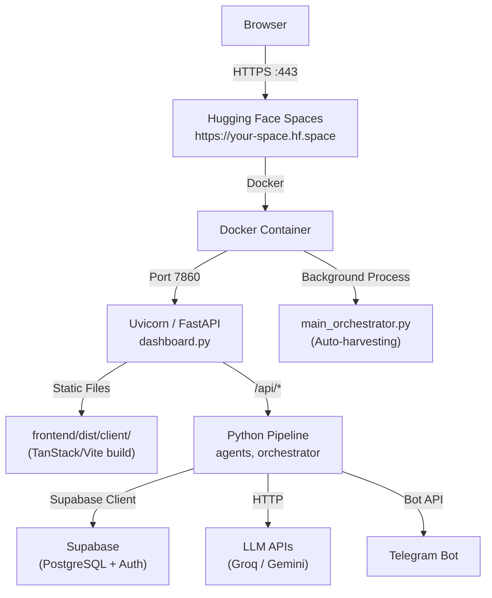

# PhantmOS — Hugging Face Spaces Deployment Plan

> **Architecture:** Monolithic (FastAPI backend + TanStack/Vite frontend served as static files)  
> **Runtime:** Docker on Hugging Face Spaces (GPU not required)  
> **Port:** `7860` (required by HF Spaces)

---

## Why Monolithic (Not Split)?

Your frontend calls backend APIs via **relative paths** (`/api/stats`, `/api/leads`).  
The FastAPI server in `dashboard.py` already serves the built frontend via `FileResponse`.  
Splitting frontend/backend would introduce CORS complexity with zero benefit at this stage.

---

## Phase 1: Build the Frontend

This must be done **locally** and the output committed to the repo before deploying.

### 1.1 Install Dependencies

```bash
cd frontend
npm install
```

### 1.2 Set Production Environment Variable

Create `frontend/.env.production`:

```env
VITE_SUPABASE_URL=https://your-project-ref.supabase.co
VITE_SUPABASE_ANON_KEY=your-anon-public-key
```

> [!IMPORTANT]
> Only use the **anon/public** key here. Never put your `SERVICE_ROLE_KEY` in the frontend — it would be exposed to every user.

### 1.3 Build the Static Bundle

```bash
npm run build
```

This outputs to `frontend/dist/`. Confirm the output path matches what `dashboard.py` expects:

```python
# dashboard.py line ~720
FRONTEND_DIST = os.path.join(os.getcwd(), "frontend", "dist", "client")
```

> [!WARNING]
> TanStack Start builds to `frontend/dist/client` (not just `frontend/dist`). If the path doesn't exist after building, check what Nitro actually outputs and update `FRONTEND_DIST` in `dashboard.py`.

### 1.4 Commit the Build Output

Hugging Face Spaces builds from the repo — you must commit the dist folder:

```bash
# Remove dist from .gitignore (add exception):
echo "!frontend/dist" >> .gitignore
echo "!frontend/dist/**" >> .gitignore

git add frontend/dist/
git commit -m "chore: add production frontend build for HF Spaces"
```

---

## Phase 2: Configure the Dockerfile

Your existing `Dockerfile` is almost production-ready. Review and confirm these points:

```dockerfile
# ✅ Already correct — HF Spaces requires port 7860
EXPOSE 7860
```

### 2.1 Add Node.js to the Dockerfile (Optional)

If you want HF Spaces to build the frontend automatically on each deploy (instead of committing `dist/`), add a Node build step:

```dockerfile
# After WORKDIR /app

# Install Node.js
RUN apt-get update && apt-get install -y nodejs npm

# Build frontend inside Docker
COPY frontend/package*.json ./frontend/
RUN cd frontend && npm ci

COPY frontend/ ./frontend/
RUN cd frontend && npm run build
```

> [!TIP]
> **Recommended approach:** Build locally and commit `dist/` to avoid adding ~5–10 minutes of build time on every HF push. Use the Docker auto-build approach only if you want fully reproducible builds.

### 2.2 Verify the Entrypoint

`entrypoint.sh` is already correct:

```bash
#!/bin/bash
set -euo pipefail

# Start the autonomous orchestrator in the background
python main_orchestrator.py &

# Start the Command Center Dashboard on port 7860
exec uvicorn dashboard:app --host 0.0.0.0 --port 7860
```

> [!NOTE]
> `main_orchestrator.py` runs as a **background process**. If it crashes, the container stays alive (uvicorn keeps running). Add error handling in the orchestrator if you need guaranteed restarts.

---

## Phase 3: Set Up Hugging Face Spaces

### 3.1 Create the Space

1. Go to [huggingface.co/new-space](https://huggingface.co/new-space)
2. Choose **Docker** as the SDK (not Gradio or Streamlit)
3. Set hardware: **CPU Basic** (free tier is sufficient — no GPU needed)
4. Set visibility: **Public** or **Private**

### 3.2 Add a `README.md` Header (Required by HF)

HF Spaces requires a special YAML front-matter block at the top of `README.md`:

```yaml
---
title: PhantmOS Engine
emoji: 👻
colorFrom: blue
colorTo: purple
sdk: docker
app_port: 7860
pinned: false
---
```

> [!CAUTION]
> The `app_port: 7860` line is **critical**. Without it, HF Spaces won't route traffic to your app. Your existing `EXPOSE 7860` in the Dockerfile must match this.

### 3.3 Link Your GitHub Repo

In the Space settings, go to **Repository → Connect to GitHub** and select `unshakensoul17/Siro`. HF will auto-deploy on every push to `main`.

---

## Phase 4: Configure Secrets (Environment Variables)

**Never commit your `.env` file.** Set all secrets in HF Spaces → **Settings → Secrets**.

Add each of the following as individual secrets:

| Secret Key | Value |
|---|---|
| `SUPABASE_URL` | `https://your-project-ref.supabase.co` |
| `SUPABASE_KEY` | Your Supabase anon/public key |
| `SERVICE_ROLE_KEY` | Your Supabase service role key (for bypassing RLS) |
| `GROQ_API_KEY` | Your Groq API key |
| `GEMINI_API_KEY` | Your Gemini API key |
| `HF_API_KEY` | Your Hugging Face API key |
| `JINA_API_KEY` | Your Jina AI embedding key |
| `TELEGRAM_BOT_TOKEN` | Your Telegram bot token |
| `TELEGRAM_WEBHOOK_SECRET` | Your webhook secret |
| `SECRET_API_ID` | Your secret job source ID |
| `SECRET_SOURCE_URL` | Your secret source URL |
| `DEFAULT_TIMEZONE` | `Asia/Kolkata` |

> [!WARNING]
> HF Spaces secrets are injected as environment variables at runtime. Your `dashboard.py` uses `python-dotenv` (`load_dotenv(override=True)`) — this is compatible with HF secrets **only if** you do NOT also have a `.env` file in the repo (`.env` must be in `.gitignore`). Confirm this before pushing.

---

## Phase 5: Configure Supabase Auth Redirect URLs

Your Supabase project needs to know the HF Spaces URL as a valid OAuth redirect origin.

1. Go to **Supabase Dashboard → Authentication → URL Configuration**
2. Add your HF Spaces URL to **Redirect URLs**:
   ```
   https://your-space-name.hf.space/**
   ```
3. Also update **Site URL** to:
   ```
   https://your-space-name.hf.space
   ```

> [!IMPORTANT]
> Without this step, Google OAuth sign-in will fail in production with a "redirect_uri_mismatch" error from Google.

---

## Phase 6: Configure Telegram Webhook

After your Space is live, update your Telegram bot webhook to point to the HF URL:

```bash
curl -X POST "https://api.telegram.org/bot<YOUR_BOT_TOKEN>/setWebhook" \
  -H "Content-Type: application/json" \
  -d '{"url": "https://your-space-name.hf.space/telegram/webhook"}'
```

Verify it worked:
```bash
curl "https://api.telegram.org/bot<YOUR_BOT_TOKEN>/getWebhookInfo"
```

---

## Phase 7: Push and Deploy

```bash
# Ensure you're on main
git checkout main

# Add the HF Spaces remote (if not already added)
git remote add space https://huggingface.co/spaces/your-username/your-space-name

# Push to HF Spaces directly (alternative to GitHub sync)
git push space main

# Or, if using GitHub sync, just push to GitHub:
git push origin main
```

HF Spaces will detect the push, rebuild the Docker image, and redeploy automatically (usually takes 3–8 minutes).

---

## Phase 8: Post-Deployment Verification Checklist

After deployment, verify each of these:

- [ ] **Landing page loads** at `https://your-space-name.hf.space`
- [ ] **Sign in with Google** redirects correctly and lands on `/dashboard`
- [ ] **`GET /api/health`** returns `{"status": "ok"}` 
- [ ] **Stats cards** on dashboard show real data (not zeros)
- [ ] **Job Discovery** page loads leads from Supabase
- [ ] **Telegram bot** responds to `/start`
- [ ] **Logo** appears correctly in the browser tab
- [ ] **Hero animation** on landing page plays smoothly

---

## Troubleshooting Common Issues

| Issue | Cause | Fix |
|---|---|---|
| App shows 404 or blank page | `FRONTEND_DIST` path is wrong | Check what `npm run build` outputs and update the path in `dashboard.py` |
| Google Sign-In fails | Supabase redirect URL not updated | Add HF Spaces URL to Supabase auth settings |
| API calls return 401 | JWT token expired or Supabase key wrong | Re-check `SUPABASE_KEY` and `SERVICE_ROLE_KEY` in HF secrets |
| Container crashes on startup | Missing env variable or import error | Check HF Spaces container logs under "Logs" tab |
| Telegram webhook not working | Webhook URL still points to localhost | Run `setWebhook` curl command with the HF Spaces URL |
| Hero animation not playing | `/hero-frames/` not in the build | Ensure `frontend/public/hero-frames/` is committed to git |

---

## Architecture Diagram


